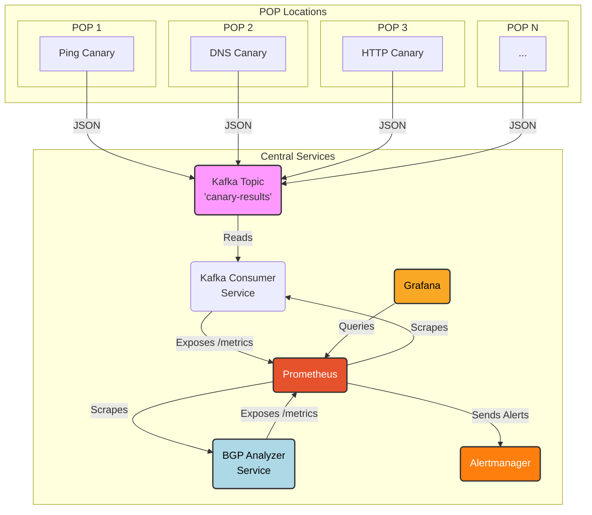

# Network Observability Platform (Open Source ThousandEyes Alternative)

## Introduction

### What is this?
This project provides a distributed system for synthetic network monitoring and BGP analysis, inspired by platforms like ThousandEyes. It allows you to:
*   Run automated tests (canaries) from various Points of Presence (POPs) to measure the reachability and performance of internet services using common network protocols:
    *   **Ping (ICMP):** Measures round-trip time (RTT) and packet loss (`canary/ping/`).
    *   **DNS:** Checks resolution time and correctness for various record types (`canary/dns/`).
    *   **HTTP(S):** Verifies availability, response time, status codes, and optional content matching (`canary/http/`).
    *   **Traceroute:** (Future) Maps the network path between the canary and the target, measuring hop-by-hop latency.
*   Passively monitor BGP updates for specified prefixes using public data streams (`bgp-analyzer/`).

Test results from canaries are collected centrally via Kafka, processed into Prometheus metrics, and visualized on dashboards. BGP events are monitored separately and also exposed as Prometheus metrics.

### Why build this?
Understanding how your services perform and how they are reachable from different network vantage points is crucial. This platform helps you:
*   **Gain User-Perspective Visibility:** See performance as your users or customers might experience it from different geographic locations or networks.
*   **Monitor Network Routing:** Observe BGP announcements and withdrawals affecting your important prefixes.
*   **Proactive Issue Detection:** Identify connectivity problems, latency spikes, service outages, or potential routing issues (like hijacks) before they impact a large number of users.
*   **Troubleshoot Connectivity:** Understand network paths and pinpoint potential bottlenecks or routing issues.
*   **Verify SLAs:** Monitor uptime and performance against service level agreements.
*   **Performance Benchmarking:** Track performance trends over time.

### Core Concepts
*   **Synthetic Monitoring:** Instead of waiting for real user traffic to reveal problems, we *synthetically* generate test traffic (like pings or HTTP requests) at regular intervals to proactively check service health.
*   **Canary / Probe:** An automated script or agent responsible for running a specific type of test (e.g., a Ping Canary) from a particular location.
*   **Point of Presence (POP):** The physical or logical location where a canary agent runs. This could be a data center, a cloud region edge, an office network, or even a user's machine.
*   **BGP Monitoring:** Passively listening to data streams from BGP collectors (like RouteViews) to observe routing table updates (announcements, withdrawals) for specific network prefixes.

## Architecture Deep Dive

### Data Flow Diagram



### Component Roles & Rationale

*   **Canaries (Python Scripts + Docker)**
    *   *Role:* Execute specific network tests (Ping, DNS, HTTP) at scheduled intervals against defined targets. Package results as structured JSON. Reside in the `canary/` subdirectories (e.g., `canary/ping/`, `canary/dns/`, `canary/http/`).
    *   *Why:* Running tests from multiple POPs gives a realistic view of global user experience. Docker ensures consistent runtime environments across diverse POPs. Python is chosen for its excellent networking libraries, ease of development, and widespread availability.
*   **Kafka (Message Broker)**
    *   *Role:* Acts as a central, highly available, and durable buffer receiving test results (JSON messages) from all *canaries* via a specific topic (e.g., `canary-results`).
    *   *Why:* Decouples canaries from the backend processing. Canaries just need to send data to Kafka and don't need to know about the consumer(s). This handles bursts of data, prevents data loss if the consumer is temporarily down, and allows for future expansion with multiple consumers.
*   **Kafka Consumer (Python Service)**
    *   *Role:* Reads the JSON results from the Kafka topic (`canary-results`). Parses the data and translates it into metrics (e.g., latency gauges, status counters) exposed via an HTTP endpoint (`/metrics`) in a format Prometheus can understand. Located in `kafka-consumer/`.
    *   *Why:* Acts as the crucial bridge between the event-driven Kafka stream from canaries and Prometheus's pull-based metric scraping model. It centralizes the logic for interpreting canary results and defining the corresponding Prometheus metrics.
*   **BGP Analyzer (Python Service)**
    *   *Role:* Connects to public BGP data streams (e.g., RouteViews, RIPE RIS) using `pybgpstream`. Monitors announcements and withdrawals for configured network prefixes. Exposes BGP event counts and timestamps as Prometheus metrics via an HTTP endpoint (`/metrics`). Located in `bgp-analyzer/`.
    *   *Why:* Provides visibility into internet routing changes affecting key prefixes. Runs as a separate central service because BGP data is typically consumed from collectors, not generated *at* individual POPs like canary tests. Exposing metrics allows correlation with canary data and alerting on routing anomalies.
*   **Prometheus (Metrics Database & Alerting Engine)**
    *   *Role:* Periodically "scrapes" (fetches) the metrics from the Kafka Consumer's `/metrics` endpoint and the BGP Analyzer's `/metrics` endpoint. Stores these metrics efficiently as time-series data. Evaluates predefined alerting rules based on the collected metrics.
    *   *Why:* An industry standard for time-series metrics and alerting. Its pull model simplifies the consumer/analyzer services. PromQL provides a powerful language for querying data and defining complex alert conditions across both canary and BGP data.
*   **Alertmanager (Alert Routing & Management)**
    *   *Role:* Receives alert notifications triggered by Prometheus. Handles deduplicating, grouping, and silencing alerts. Routes alerts to configured notification channels (e.g., Slack, PagerDuty, email - *configuration needed*).
    *   *Why:* Separates the complex logic of alert notification from Prometheus. Provides a central point for managing alert state.
*   **Grafana (Visualization)**
    *   *Role:* Queries Prometheus (using PromQL) and displays the time-series metrics on interactive dashboards featuring graphs, tables, heatmaps, etc.
    *   *Why:* The de facto standard for visualizing observability data. Highly flexible, supports numerous panel types, and makes it easy to explore trends, correlate data from different sources (canaries, BGP), and identify anomalies visually.

## Getting Started: Running Locally with Docker Compose

This setup allows you to run the entire backend infrastructure (Kafka, Prometheus, Grafana, etc.), the Kafka Consumer service, and the BGP Analyzer service on your local machine for development and testing.

### Prerequisites
*   **Docker Engine:** Install Docker for your OS. [Official Docker Installation Guide](https://docs.docker.com/engine/install/)
*   **Docker Compose:** Usually included with Docker Desktop. Verify installation. [Official Docker Compose Installation Guide](https://docs.docker.com/compose/install/)
*   **Git:** Needed to clone the repository. [Official Git Installation Guide](https://git-scm.com/book/en/v2/Getting-Started-Installing-Git)
*   **(Optional but Recommended) Host Tools:** Install `fping`, `dnsutils` (for `dig`), `curl` on your host machine if you want to run canaries directly using Python (Method 2 below). On macOS: `brew install fping dnsutils curl`. On Debian/Ubuntu: `sudo apt-get update && sudo apt-get install fping dnsutils curl`.

### Setup Steps
1.  **Clone the Repository:**
    ```bash
    git clone https://github.com/shankar0123/network-observability-platform.git
    cd network-observability-platform
    ```
2.  **Navigate to Infrastructure Directory:**
    ```bash
    cd infra
    ```
3.  **Launch the Stack:**
    ```bash
    docker-compose up --build -d
    ```
    *   `--build`: Ensures the `kafka-consumer` and `bgp-analyzer` Docker images are built using their Dockerfiles. Needed the first time or when their source code/requirements change.
    *   `up`: Creates and starts all the service containers defined in `docker-compose.yml`.
    *   `-d`: Runs the containers in "detached" mode.

### Verify Services
*   **Check Container Status:** Wait a minute or two for services to initialize, then run:
    ```bash
    docker-compose ps
    ```
    All services listed (`zookeeper`, `kafka`, `kafka-consumer`, `prometheus`, `alertmanager`, `grafana`, `bgp-analyzer`) should have a `State` of `Up` or `running`.
*   **Access Web UIs:** Open these URLs in your browser:
    *   **Prometheus:** `http://localhost:9090`
    *   **Grafana:** `http://localhost:3001` (Default Login: `admin` / `admin`)
    *   **Alertmanager:** `http://localhost:9094`
*   **Check Prometheus Targets:**
    1.  Go to the Prometheus UI (`http://localhost:9090`).
    2.  Navigate to `Status` -> `Targets`.
    3.  Look for the `kafka-consumer` and `bgp-analyzer` jobs. Their `State` should be `UP`. If `DOWN`, check the logs of the respective container (e.g., `docker-compose logs kafka-consumer`, `docker-compose logs bgp-analyzer`). The `bgp-analyzer` might take a short while to connect initially.

## Running Canaries

Once the backend stack is running, run one or more canary agents to send data into the system.

### Understanding Canary Configuration
Canaries are configured primarily through environment variables:
*   `CANARY_ID`: Unique identifier (e.g., `ping-pop-lhr-01`, `dns-pop-nyc-02`).
*   `KAFKA_BROKER`: Kafka broker address(es).
*   `KAFKA_TOPIC`: Kafka topic (e.g., `canary-results`).
*   `TARGET_HOSTS` / `TARGET_DOMAINS` / `TARGET_URLS`: Comma-separated list of targets.
*   `*_INTERVAL_SECONDS`: How often to run tests.
*   Other type-specific options (e.g., `QUERY_TYPE`, `EXPECTED_STRING`).

### Method 1: Run Canary via Docker (Recommended)
Build and run the desired canary container, connecting it to the Docker network.

1.  **Build Image (Example: DNS Canary):**
    ```bash
    cd ../canary/dns # Navigate to the canary directory
    docker build -t dns-canary:latest .
    ```
2.  **Run Container (Example: DNS Canary):**
    ```bash
    # Find network name: docker network ls | grep monitoring (likely 'infra_monitoring')
    NETWORK_NAME="infra_monitoring" # Replace if different

    docker run --rm --network=$NETWORK_NAME \
      -e KAFKA_BROKER="kafka:9092" \
      -e KAFKA_TOPIC="canary-results" \
      -e CANARY_ID="dns-docker-test-01" \
      -e TARGET_DOMAINS="example.com,wikipedia.org" \
      -e QUERY_TYPE="AAAA" \
      -e DNS_INTERVAL_SECONDS="45" \
      dns-canary:latest
    ```
    *   Repeat for other canary types (e.g., `ping-canary`, `http-canary`), adjusting image name and environment variables.

### Method 2: Run Canary Locally using Python (Development/Debugging)
Run the script directly on your host. Remember to set `KAFKA_BROKER` to the host-exposed port (`localhost:9093`).

1.  **Navigate & Setup (Example: HTTP Canary):**
    ```bash
    cd ../canary/http
    python -m venv venv
    source venv/bin/activate # Or .\venv\Scripts\activate on Windows
    pip install -r requirements.txt
    ```
2.  **Configure & Run:**
    ```bash
    export KAFKA_BROKER="localhost:9093" # Host port!
    export CANARY_ID="http-local-dev-01"
    export TARGET_URLS="https://httpbin.org/status/200,https://httpbin.org/status/404"
    python http_canary.py
    ```

## Exploring the Data

1.  **Check Logs:**
    *   Canary data: `docker-compose logs -f kafka-consumer`
    *   BGP events: `docker-compose logs -f bgp-analyzer`
2.  **Query Metrics in Prometheus (`http://localhost:9090/graph`):**
    *   **Canary Latency:** `canary_latency_ms{type="ping", target="8.8.8.8"}`
    *   **DNS Latency:** `dns_resolve_time_ms{target="example.com", query_type="AAAA"}`
    *   **HTTP Status:** `http_status_code{target="https://httpbin.org/status/404"}`
    *   **Content Match:** `http_content_match_status{canary_id="http-local-dev-01"}`
    *   **Ping Failures:** `rate(canary_status_total{type="ping", status="FAILURE"}[5m])`
    *   **BGP Announcements:** `rate(bgp_announcements_total{prefix="1.1.1.0/24"}[10m])`
    *   **BGP Withdrawals:** `increase(bgp_withdrawals_total{prefix="8.8.8.0/24"}[1h])`
    *   **BGP Analyzer Freshness:** `time() - bgp_last_event_timestamp_seconds` (Shows seconds since last event per project)
3.  **Visualize Data in Grafana (`http://localhost:3001`):**
    *   Add Prometheus Data Source (URL: `http://prometheus:9090`, Access: `Server`).
    *   Create dashboards combining canary metrics (latency, status) and BGP metrics (announcements, withdrawals) using the queries above.

## Next Steps & Future Development
*   **Implement Traceroute Canary:** Develop the `canary/traceroute/` component using `mtr` or `scamper`. Update the consumer to handle its complex output (hop-by-hop data).
*   **Build Grafana Dashboards:** Create comprehensive dashboards showing global maps, latency/status summaries per test type, BGP event timelines, etc.
*   **Configure Alerting:** Define meaningful alert rules in Prometheus (e.g., high latency, low success rate, specific HTTP errors, unexpected BGP withdrawals, BGP analyzer staleness). Configure Alertmanager to route alerts.
*   **Deployment to POPs:** Document deploying canary containers to actual POP locations.
*   **Security:** Implement Kafka security, add authentication to UIs, secure Grafana login.
*   **Persistence:** Configure persistent volumes for Kafka/Zookeeper in `docker-compose.yml` if needed.
*   **Refine BGP Analyzer:** Add more sophisticated analysis (path changes, RPKI validation), consider internal BGP feeds.

## Troubleshooting
*   **`docker-compose up` fails:** Check for port conflicts, ensure Docker daemon is running, check network connectivity.
*   **Prometheus Target `kafka-consumer` or `bgp-analyzer` is DOWN:** Check container logs (`docker-compose logs <service_name>`). Verify Docker networking. Ensure Prometheus scrape config matches the service name and port.
*   **No data in Grafana/Prometheus:** Is a canary running? Is the consumer processing messages (check logs)? Is the BGP analyzer running and receiving data (check logs)? Is Prometheus scraping targets successfully? Are PromQL queries correct? Is the Grafana time range correct?
*   **BGP Analyzer Issues:** `pybgpstream` can be sensitive to network conditions or collector availability. Check its logs for connection errors. Ensure monitored prefixes are valid.
