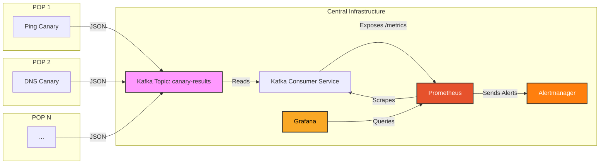

# Network Observability Platform (Open Source ThousandEyes Alternative)

## Introduction

### What is this?
This project provides a distributed system for synthetic network monitoring, inspired by platforms like ThousandEyes. It allows you to run automated tests (canaries) from various Points of Presence (POPs) to measure the reachability and performance of internet services using common network protocols:
*   **Ping (ICMP):** Measures round-trip time (RTT) and packet loss.
*   **DNS:** Checks resolution time and correctness for various record types.
*   **HTTP(S):** Verifies availability, response time, and status codes of web services.
*   **Traceroute:** Maps the network path between the canary and the target, measuring hop-by-hop latency.

Test results are collected centrally, processed into metrics, and visualized on dashboards.

### Why build this?
Understanding how your services perform from different network vantage points is crucial. This platform helps you:
*   **Gain User-Perspective Visibility:** See performance as your users or customers might experience it from different geographic locations or networks.
*   **Proactive Issue Detection:** Identify connectivity problems, latency spikes, or service outages before they impact a large number of users.
*   **Troubleshoot Connectivity:** Understand network paths and pinpoint potential bottlenecks or routing issues.
*   **Verify SLAs:** Monitor uptime and performance against service level agreements.
*   **Performance Benchmarking:** Track performance trends over time.

### Core Concepts
*   **Synthetic Monitoring:** Instead of waiting for real user traffic to reveal problems, we *synthetically* generate test traffic (like pings or HTTP requests) at regular intervals to proactively check service health.
*   **Canary / Probe:** An automated script or agent responsible for running a specific type of test (e.g., a Ping Canary) from a particular location.
*   **Point of Presence (POP):** The physical or logical location where a canary agent runs. This could be a data center, a cloud region edge, an office network, or even a user's machine.

## Architecture Deep Dive

### Data Flow Diagram



### Component Roles & Rationale

*   **Canaries (Python Scripts + Docker)**
    *   *Role:* Execute specific network tests (Ping, DNS, etc.) at scheduled intervals against defined targets. Package results as structured JSON. Reside in the `canary/` subdirectories (e.g., `canary/ping/`).
    *   *Why:* Running tests from multiple POPs gives a realistic view of global user experience. Docker ensures consistent runtime environments across diverse POPs. Python is chosen for its excellent networking libraries, ease of development, and widespread availability.
*   **Kafka (Message Broker)**
    *   *Role:* Acts as a central, highly available, and durable buffer receiving test results (JSON messages) from all canaries via a specific topic (e.g., `canary-results`).
    *   *Why:* Decouples canaries from the backend processing. Canaries just need to send data to Kafka and don't need to know about the consumer(s). This handles bursts of data, prevents data loss if the consumer is temporarily down, and allows for future expansion with multiple consumers (e.g., one for metrics, another for real-time anomaly detection).
*   **Kafka Consumer (Python Service)**
    *   *Role:* Reads the JSON results from the Kafka topic (`canary-results`). Parses the data and translates it into metrics (e.g., latency gauges, status counters) exposed via an HTTP endpoint (`/metrics`) in a format Prometheus can understand. Located in `kafka-consumer/`.
    *   *Why:* Acts as the crucial bridge between the event-driven Kafka stream and Prometheus's pull-based metric scraping model. It centralizes the logic for interpreting canary results and defining the corresponding Prometheus metrics.
*   **Prometheus (Metrics Database & Alerting Engine)**
    *   *Role:* Periodically "scrapes" (fetches) the metrics from the Kafka Consumer's `/metrics` endpoint. Stores these metrics efficiently as time-series data. Evaluates predefined alerting rules based on the collected metrics.
    *   *Why:* An industry standard for time-series metrics and alerting. Its pull model simplifies the consumer service (doesn't need to push). PromQL provides a powerful language for querying data and defining complex alert conditions.
*   **Alertmanager (Alert Routing & Management)**
    *   *Role:* Receives alert notifications triggered by Prometheus. Handles deduplicating, grouping, and silencing alerts. Routes alerts to configured notification channels (e.g., Slack, PagerDuty, email - *configuration needed*).
    *   *Why:* Separates the complex logic of alert notification (routing, silencing, inhibition) from Prometheus, whose primary job is metric collection and rule evaluation. Provides a central point for managing alert state.
*   **Grafana (Visualization)**
    *   *Role:* Queries Prometheus (using PromQL) and displays the time-series metrics on interactive dashboards featuring graphs, tables, heatmaps, etc.
    *   *Why:* The de facto standard for visualizing observability data. Highly flexible, supports numerous panel types, and makes it easy to explore trends, correlate data, and identify anomalies visually.

## Getting Started: Running Locally with Docker Compose

This setup allows you to run the entire backend infrastructure (Kafka, Prometheus, Grafana, etc.) and the Kafka Consumer service on your local machine for development and testing.

### Prerequisites
*   **Docker Engine:** Install Docker for your OS. [Official Docker Installation Guide](https://docs.docker.com/engine/install/)
*   **Docker Compose:** Usually included with Docker Desktop. Verify installation. [Official Docker Compose Installation Guide](https://docs.docker.com/compose/install/)
*   **Git:** Needed to clone the repository. [Official Git Installation Guide](https://git-scm.com/book/en/v2/Getting-Started-Installing-Git)
*   **(Optional but Recommended) `fping`:** Install `fping` on your host machine if you want to run the Ping canary directly using Python (Method 2 below). On macOS: `brew install fping`. On Debian/Ubuntu: `sudo apt-get update && sudo apt-get install fping`.

### Setup Steps
1.  **Clone the Repository:**
    ```bash
    git clone <your-repository-url> # Replace with the actual URL
    cd network-observability-platform
    ```
2.  **Navigate to Infrastructure Directory:**
    ```bash
    cd infra
    ```
3.  **Launch the Stack:**
    ```bash
    docker-compose up --build -d
    ```
    *   `--build`: Ensures the `kafka-consumer` Docker image is built using its Dockerfile. You only strictly need this the first time or when `kafka-consumer.py` or its `requirements.txt` changes.
    *   `up`: Creates and starts all the service containers (Kafka, Zookeeper, Prometheus, etc.) defined in `docker-compose.yml`.
    *   `-d`: Runs the containers in "detached" mode (in the background). You won't see logs directly in this terminal window.

### Verify Services
    *   **Check Container Status:** Wait a minute or two for services to initialize, then run:
        ```bash
        docker-compose ps
        ```
        All services listed should have a `State` of `Up` or `running`.
    *   **Access Web UIs:** Open these URLs in your browser:
        *   **Prometheus:** `http://localhost:9090`
        *   **Grafana:** `http://localhost:3001` (Default Login: `admin` / `admin`)
        *   **Alertmanager:** `http://localhost:9094`
*   **Check Prometheus Targets:**
    1.  Go to the Prometheus UI (`http://localhost:9090`).
    2.  Navigate to `Status` -> `Targets`.
    3.  Look for the `kafka-consumer` job. Its `State` should be `UP`. If it's `DOWN`, check the logs of the `kafka-consumer` container (`docker-compose logs kafka-consumer`).

## Running Your First Canary (Ping Example)

Once the backend stack is running via Docker Compose, you need to run a canary agent to send data into the system.

### Understanding Canary Configuration
Canaries are configured primarily through environment variables (as defined in their respective Dockerfiles or set manually when running locally):
*   `CANARY_ID`: A unique identifier for this specific canary instance (e.g., `ping-pop-lhr-01`). Crucial for distinguishing data from different locations.
*   `KAFKA_BROKER`: The address of the Kafka broker(s) the canary should send results to.
*   `KAFKA_TOPIC`: The Kafka topic to publish results on (should match the consumer's topic, e.g., `canary-results`).
*   `TARGET_HOSTS`: A comma-separated list of hosts or IP addresses for the canary to test (e.g., `"8.8.8.8,1.1.1.1,google.com"`).
*   `PING_INTERVAL_SECONDS` (for Ping Canary): How often (in seconds) to run the ping tests against all targets.
*   `PING_COUNT` (for Ping Canary): How many ping packets to send per target in each interval.

### Method 1: Run Canary via Docker (Recommended for Deployment)
This method runs the canary in its own container, simulating how it would run in a real POP.

1.  **Build the Canary Image:**
    ```bash
    # Navigate to the specific canary directory
    cd ../canary/ping
    docker build -t ping-canary:latest .
    ```
2.  **Run the Canary Container:**
    ```bash
    # Make sure you are in the project root or adjust paths accordingly
    # Find your docker-compose network name (usually projectdir_networkname)
    # Run 'docker network ls | grep monitoring' - it's likely 'infra_monitoring'
    NETWORK_NAME="infra_monitoring" # Replace if different

    docker run --rm --network=$NETWORK_NAME \
      -e KAFKA_BROKER="kafka:9092" \
      -e KAFKA_TOPIC="canary-results" \
      -e CANARY_ID="ping-docker-test-01" \
      -e TARGET_HOSTS="8.8.8.8,1.1.1.1" \
      -e PING_INTERVAL_SECONDS="30" \
      ping-canary:latest
    ```
    *   `--rm`: Cleans up the container when it stops.
    *   `--network=$NETWORK_NAME`: Connects the canary container to the same network as the Kafka broker defined in `docker-compose.yml`. This allows it to reach Kafka using the service name `kafka`.
    *   `-e KAFKA_BROKER="kafka:9092"`: Tells the canary to use the internal Docker network address for Kafka.
    *   Other `-e` flags: Set the specific configuration for this canary instance.

### Method 2: Run Canary Locally using Python (for Development/Debugging)
This method runs the canary script directly on your host machine. Useful for quick testing and debugging the script itself.

1.  **Navigate & Setup Environment:**
    ```bash
    cd ../canary/ping # Relative to infra directory, or absolute path
    python -m venv venv # Create a virtual environment (optional but good practice)
    source venv/bin/activate # Activate (use .\venv\Scripts\activate on Windows)
    pip install -r requirements.txt # Install dependencies
    ```
2.  **Configure Environment Variables:** You *must* tell the script how to reach Kafka from your host machine. Docker Compose exposes Kafka on port `9093` on the host (`localhost`).
    ```bash
    export KAFKA_BROKER="localhost:9093" # Use host-exposed port!
    export KAFKA_TOPIC="canary-results"
    export CANARY_ID="ping-local-dev-01"
    export TARGET_HOSTS="8.8.8.8,1.1.1.1,github.com"
    export PING_INTERVAL_SECONDS="60"
    # Optional: For more detailed logs during dev
    # export LOG_LEVEL="DEBUG"
    ```
    *(Alternatively, create a `.env` file in the `canary/ping` directory with these key-value pairs)*
3.  **Run the Script:**
    ```bash
    python ping_canary.py
    ```
    You should see log output in your terminal indicating connection to Kafka and ping attempts. Press `Ctrl+C` to stop.

## Exploring the Data

Once a canary is running and sending data:

1.  **Check Kafka Consumer Logs:** See the raw JSON messages being processed and metrics being updated.
    ```bash
    # Run from the infra directory
    docker-compose logs -f kafka-consumer
    ```
2.  **Query Metrics in Prometheus:**
    *   Go to `http://localhost:9090/graph`.
    *   In the "Expression" bar, try some PromQL queries:
        *   `canary_latency_ms`: Shows current latency for all canaries.
        *   `canary_latency_ms{type="ping"}`: Filter for ping latency only.
        *   `canary_latency_ms{canary_id="ping-docker-test-01", target="8.8.8.8"}`: Latency for a specific canary testing a specific target.
        *   `ping_packet_loss_percent{target="github.com"}`: Packet loss for a specific target.
        *   `rate(canary_status_total{status="FAILURE"}[5m])`: Calculate the per-second rate of test failures over the last 5 minutes.
        *   `sum by (target) (rate(canary_status_total{type="ping"}[10m]))`: Total rate of ping tests per target over 10 mins.
    *   Click "Execute" and view the results in the "Table" or "Graph" tab.
3.  **Visualize Data in Grafana:**
    1.  Go to `http://localhost:3001` (Login: `admin`/`admin`).
    2.  **Add Data Source:**
        *   Click the gear icon (Configuration) on the left sidebar -> `Data Sources`.
        *   Click `Add data source`.
        *   Select `Prometheus`.
        *   Set the `URL` to `http://prometheus:9090`. (Grafana runs in Docker, so it uses the service name `prometheus`).
        *   Leave other settings as default. Click `Save & Test`. You should see "Data source is working".
    3.  **Create a Dashboard:**
        *   Click the `+` icon (Create) on the left sidebar -> `Dashboard`.
        *   Click `Add new panel`.
        *   In the query editor:
            *   Ensure `Prometheus` is selected as the data source.
            *   Enter a PromQL query in the `Metrics browser` or `Code` tab (e.g., `canary_latency_ms{type="ping"}`).
            *   Choose a visualization type on the right (e.g., `Time series`).
            *   Customize panel title, axes, legend format (e.g., `{{canary_id}} - {{target}}`).
        *   Click `Apply`.
        *   Save the dashboard (disk icon at the top right).

## Next Steps & Future Development
*   **Implement Other Canary Types:** Develop the DNS, HTTP, and Traceroute canaries in their respective `canary/` subdirectories, following the pattern of the Ping canary (script, requirements, Dockerfile). Update the `kafka-consumer` to parse their specific JSON output fields and expose relevant Prometheus metrics.
*   **Build Grafana Dashboards:** Create more sophisticated dashboards showing global maps, latency heatmaps, status summaries, and detailed views per target/canary.
*   **Configure Alerting:** Define meaningful alert rules in Prometheus (`prometheus.yml` or separate `*.rules.yml` file) based on metrics like high latency, high packet loss, HTTP errors, or DNS failures. Configure Alertmanager (`alertmanager.yml`) to route these alerts to desired notification channels (e.g., Slack).
*   **Deployment to POPs:** Document the process for deploying canary Docker containers to actual POP locations (using Docker run, Kubernetes, Ansible, etc.). This involves configuring them to point to the central Kafka endpoint and managing secrets/credentials securely.
*   **Security:** Implement Kafka security (TLS encryption, SASL authentication), add authentication to Prometheus/Alertmanager UIs, secure Grafana login.
*   **Phase 2 Goals:** Explore BGP event analysis, AS-path visualization, REST API for results, etc.

## Troubleshooting
*   **`docker-compose up` fails:**
    *   *Port conflicts:* Check the error message for `port is already allocated`. Stop the conflicting process or change the host port mapping in `docker-compose.yml`.
    *   *Docker daemon not running:* Ensure Docker Desktop or Docker Engine service is running.
    *   *Network issues:* Check internet connection if images fail to pull.
*   **Prometheus Target `kafka-consumer` is DOWN:**
    *   Check consumer logs: `docker-compose logs kafka-consumer`. Look for errors connecting to Kafka or starting the HTTP server.
    *   Verify network: Ensure Prometheus and the consumer are on the same Docker network (`docker network inspect infra_monitoring`).
    *   Check port: Ensure the consumer is listening on port 8000 inside the container and Prometheus is configured to scrape that port.
*   **No data in Grafana/Prometheus:**
    *   Is a canary running and sending data? Check canary logs.
    *   Is the `kafka-consumer` processing messages? Check its logs.
    *   Is Prometheus scraping the consumer successfully (`Status` -> `Targets` in Prometheus UI)?
    *   Are the PromQL queries correct? Test simple queries first (e.g., `up{job="kafka-consumer"}`).
    *   Is the time range in Grafana set correctly?
